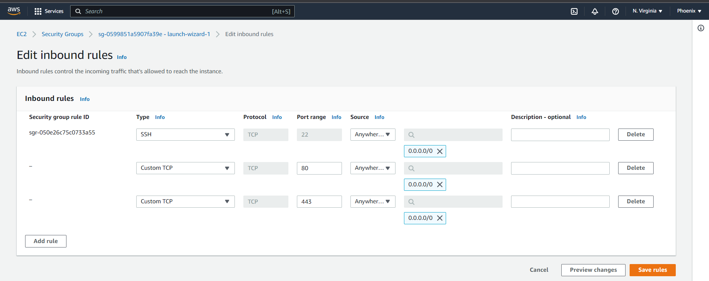
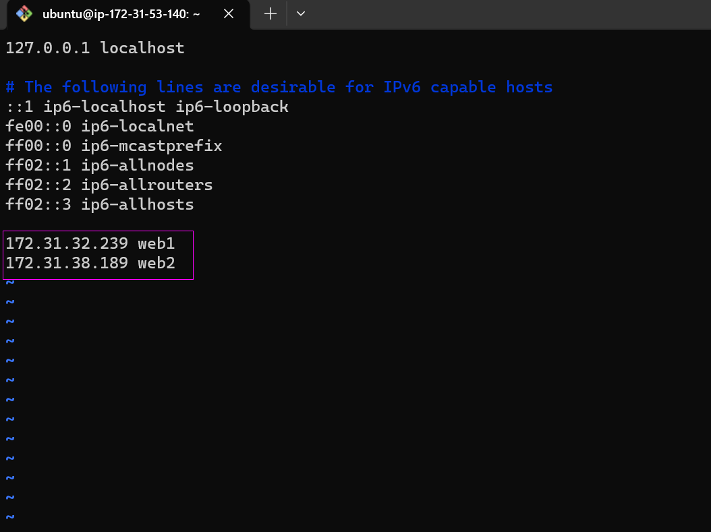
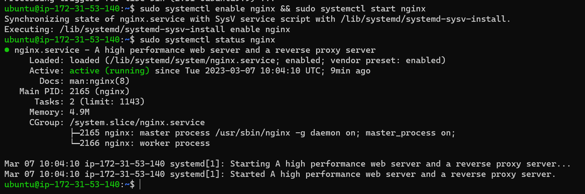

## Load Balancer Solution With Nginx and SSL/TLS
It's critical we secure our client-server communcation with a more secured protocol such as HTTPS. This is to prevent security threats one of which is called Man-In-The-Middle (MIMT) attack.

SSL and its newer version, TSL - is a security technology that protects connection from MITM attacks by creating an encrypted session between browser and Web server..

SSL/TLS uses digital certificates to identify and validate a Website. A browser reads the certificate issued by a Certificate Authority (CA) to make sure that the website is registered in the CA so it can be trusted to establish a secured connection.

Task
In this project we'll register our website using LetsEnrcypt Certificate Authority, to automate certificate issuance we'll use a shell client recommended by LetsEncrypt - cetrbot.

Configure Nginx as a Load Balancer
Register a new domain name and configure secured connection using SSL/TLS certificates
Your target architecture will look like this:


## Configure Nginx As A Load Balancer

You can either uninstall Apache from the existing Load Balancer server, or create a fresh installation of Linux for Nginx (I prefer the latter).

1. Create a VM based on Ubuntu Server 20.04 LTS and name it Nginx LB.
> Don't forget to open TCP port 80 and 443, for HTTP and secured HTTPS connections respectively).

> 

2. Update /etc/hosts file for local DNS with Web Servers’ names (e.g. Web1 and Web2) and their local IP addresses

```
#Open this file on your LB server

`sudo vi /etc/hosts`

#Add 2 records into this file with Local IP address and arbitrary name for both of your Web Servers

<WebServer1-Private-IP-Address> Web1
<WebServer2-Private-IP-Address> Web2
```


3. Install and configure Nginx as a load balancer to point traffic to the resolvable DNS names of the webservers

`sudo apt update && sudo apt install nginx`

Ensure nginx is running and enable it across reboots

`sudo systemctl start nginx && sudo systemctl enable nginx`

```
Synchronizing state of nginx.service with SysV service script with /lib/systemd/s
ystemd-sysv-install.
Executing: /lib/systemd/systemd-sysv-install enable nginx
```

`sudo systemctl status nginx`



