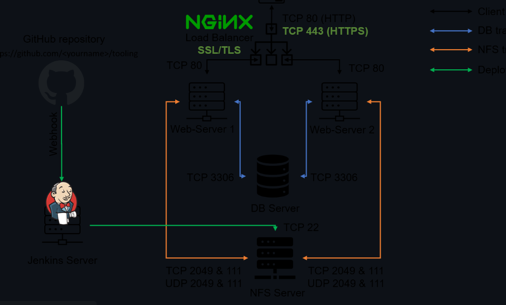
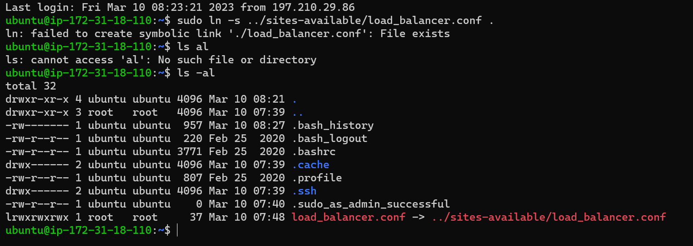
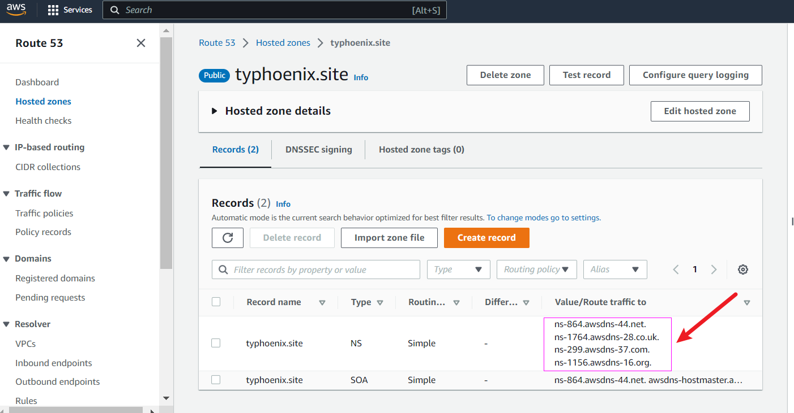
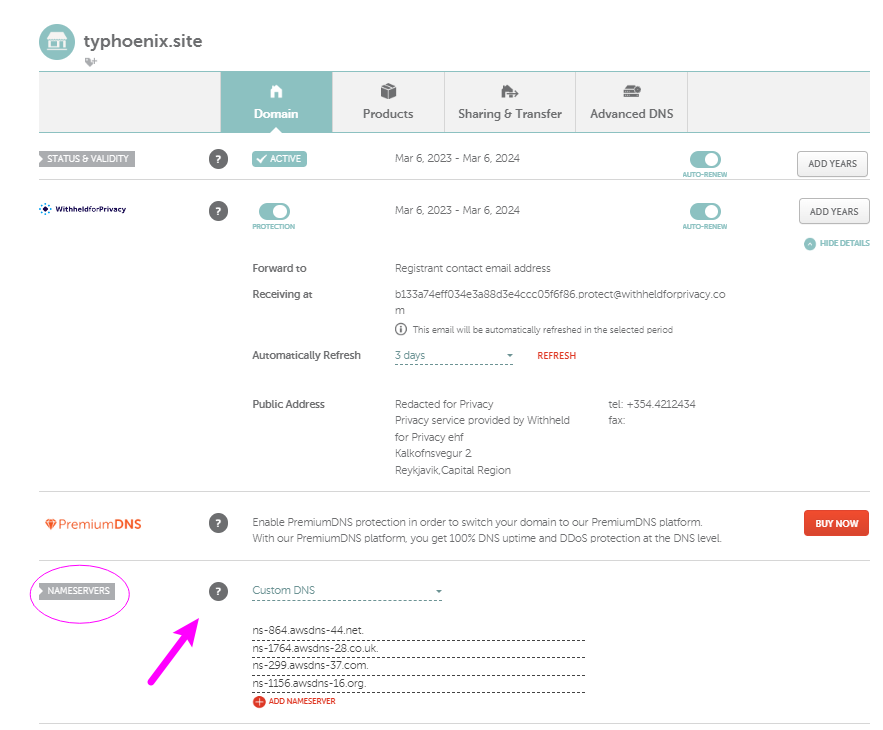

## Load Balancer Solution With Nginx and SSL/TLS 
It's critical we secure our client-server communcation with a more secured protocol such as HTTPS. This is to prevent security threats one of which is called Man-In-The-Middle (MIMT) attack

SSL and its newer version, TSL - is a security technology that protects connection from MITM attacks by creating an encrypted session between browser and Web server..

SSL/TLS uses digital certificates to identify and validate a Website. A browser reads the certificate issued by a Certificate Authority (CA) to make sure that the website is registered in the CA so it can be trusted to establish a secured connection.

Task
In this project we'll register our website using LetsEnrcypt Certificate Authority, to automate certificate issuance we'll use a shell client recommended by LetsEncrypt - cetrbot.

Configure Nginx as a Load Balancer
Register a new domain name and configure secured connection using SSL/TLS certificates
Your target architecture will look like this:



## Configure Nginx As A Load Balancer

You can either uninstall Apache from the existing Load Balancer server, or create a fresh installation of Linux for Nginx (I prefer the latter).

1. Create a VM based on Ubuntu Server 20.04 LTS and name it Nginx LB.
> Don't forget to open TCP port 80 and 443, for HTTP and secured HTTPS connections respectively).

> 

2. Update /etc/hosts file for local DNS with Web Servers’ names (e.g. Web1 and Web2) and their local IP addresses

```
#Open this file on your LB server

`sudo vi /etc/hosts`

#Add 2 records into this file with Local IP address and arbitrary name for both of your Web Servers

<WebServer1-Private-IP-Address> Web1
<WebServer2-Private-IP-Address> Web2
```


3. Install and configure Nginx as a load balancer to point traffic to the resolvable DNS names of the webservers

`sudo apt update && sudo apt install nginx`

Ensure nginx is running and enable it across reboots

`sudo systemctl start nginx && sudo systemctl enable nginx`

```
Synchronizing state of nginx.service with SysV service script with /lib/systemd/s
ystemd-sysv-install.
Executing: /lib/systemd/systemd-sysv-install enable nginx
```

`sudo systemctl status nginx`


4. Create a config file for nginx, and paste in the following lines:

`sudo vi /etc/nginx/sites-available/load_balancer.conf`

```
#insert following configuration into http section

upstream myproject {
    server Web1 weight=5;
    server Web2 weight=5;
  }
server {
    listen 80;
    server_name typhoenix.site www.typhoenix.site;
    location / {
      proxy_set_header X-Forwarded-For $proxy_add_x_forwarded_for;
      proxy_pass http://myproject;
    }
  }

#comment out this line
#       include /etc/nginx/sites-enabled/*;
```

> My load_balancer.conf contains my domain name instead of default `server_name www.domain.com`

- Remove the default nginx config file;

`sudo rm -rf /etc/nginx/sites-enabled/default`

- Symbolically link the sites-avalaible and sites-enabled together

`sudo ln -s /etc/nginx/sites-available /etc/nginx/sites-enabled`

> **Gotcha!** You need to understand that the target of a symlink is a pathname. And it can be absolute or relative to the directory which contains the symlink.

Assuming you have load_balancer.conf in sites-available. You'd try:

```
cd sites-enabled
sudo ln -s ../sites-available/load_balancer.conf .

ls -l
Now you will have a symlink in sites-enabled called load_balancer.conf which has a target ../sites-available/load_balancer.conf

- Verify the syntax of your Nginx configuration by running:

`sudo nginx -t`

```
Output:

nginx: the configuration file /etc/nginx/nginx.conf syntax is ok
nginx: configuration file /etc/nginx/nginx.conf test is successful




- Now reload Nginx (due to the major changes you've made to the config file)

`sudo systemctl reload nginx`

## Register a new domain name and configure secured connection using SSL/TLS certificates

In order to get a valid SSL certificate - we'll need to register a new domain name, you can do it using any **Domain name registrar** - a company that manages reservation of domain names. The most popular ones are: Godaddy.com, Domain.com, Bluehost.com (I used namecheap.com)

- Register a new domain name with any registrar of your choice in any domain zone (e.g. .com, .net, .org, .edu, .info, .xyz or any other).
- Create a DNS Zone (I used AWS, feel free to use whatever the equivalence is in your Cloud Provider).
- Establish an handshake between your newly created zone and your domain, by copying over the name servers from your Cloud DNS to your Domain.


- Update the *A record* in your Cloud DNS to point to Nginx LB Public address
  
  
By following all of these processes above, we can be sure there's a secured handshake between the three parties ie. Nginx Load Balancer, Cloud DNS and the Web Servers.

### Install Certbot

- Install certbot (you can either use snap or apt for the package manager)

`sudo apt install certbot`

Or

`$ sudo systemctl status snapd`

 `$ sudo snap install --classic certbot`

- Also install a crucial certbot dependency

`sudo apt install python3-certbot-nginx -y`

- Request for a TLS certificate for your domain:

`sudo certbot --nginx -d typhoenix.site -d typhoenix.site`

At the end of all the resulting prompts, you should end up with something like this:

```
IMPORTANT NOTES:                                                             
 - Congratulations! Your certificate and chain have been saved at:           
   /etc/letsencrypt/live/typhoenix.ml/fullchain.pem
   Your key file has been saved at:
   /etc/letsencrypt/live/typhoenix.ml/privkey.pem
   Your cert will expire on 2024-03-10. To obtain a new or tweaked
   version of this certificate in the future, simply run certbot again
   with the "certonly" option. To non-interactively renew *all* of
   your certificates, run "certbot renew"
 - Your account credentials have been saved in your Certbot
   configuration directory at /etc/letsencrypt. You should make a
   secure backup of this folder now. This configuration directory will
   also contain certificates and private keys obtained by Certbot so
   making regular backups of this folder is ideal.
 - If you like Certbot, please consider supporting our work by:
   Donating to ISRG / Let's Encrypt:   https://letsencrypt.org/donate
   Donating to EFF:                    https://eff.org/donate-le

```

You shall be able to access your website by using HTTPS protocol (that uses TCP port 443) and see a padlock pictogram in your browser’s search string. Click on the padlock icon and you can see the details of the certificate issued for your website.

### Setup a Cronjob for periodic renewal of the TLS Cert

It's best pracice is to have a scheduled job that to run renew command periodically. So let's configure a cronjob to run the command twice a day.

`sudo nano crontab -e`

Add following line:

`* */12 * * *   root /usr/bin/certbot renew > /dev/null 2>&1
`

### **Congratulations!**
You've just implemented an Nginx Load Balancing Web Solution with secured HTTPS connection with periodically updated SSL/TLS certificates.
